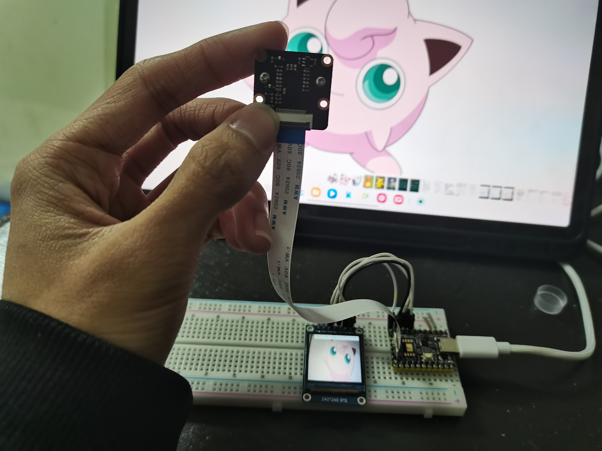
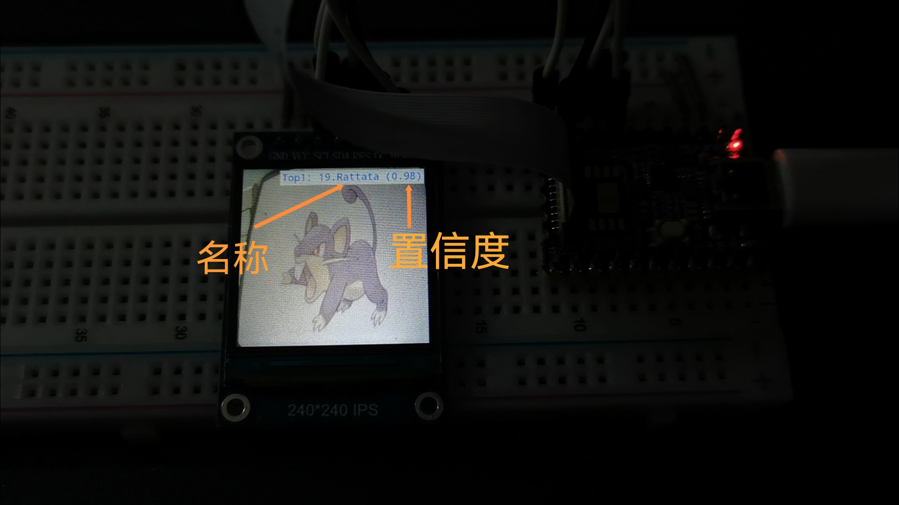

# Pokemon Predict 宝可梦精灵检测

这是一个基于MobileNetV2训练的宝可梦模型，移植到rv1103平台的项目。

使用luckfox pico mini开发板，产品介绍：[https://wiki.luckfox.com/zh/Luckfox-Pico/Luckfox-Pico-RV1103/Luckfox-Pico-quick-start/]()

摄像头是配套的SC3336，使用可以参考：[https://wiki.luckfox.com/zh/Luckfox-Pico/Luckfox-Pico-RV1103/Luckfox-Pico-Plus-Mini/Luckfox-Pico-pinout/CSI-Camera]()

## 使用演示





视频演示：【基于MobileNetV2训练宝可梦识别模型部署在rv1103平台】 https://www.bilibili.com/video/BV1MX96YMEUx/?share_source=copy_web&vd_source=38234226a0579c89438fe95706838522

## MobileNetV2简介

MobileNetV2 是 Google 于 2018 年推出的一款专为移动设备和嵌入式系统设计的轻量级卷积神经网络模型。它是 MobileNetV1 的升级版，旨在提高模型的效率和准确性，同时保持低计算成本和小内存占用。

## 训练MobileNetV2模型，转换为ONNX模型以及转换为RKNN模型

可以参考：[【MobileNetv2图像分类部署至RK3588】模型训练→转换RKNN→开发板部署_rk3588 mobilenet-CSDN博客](https://blog.csdn.net/A_l_b_ert/article/details/142283122)

## 驱动屏幕

要使检测结果输出到屏幕上，需要为屏幕准备好驱动，并将带有相应驱动的镜像重新烧录给开发板，[具体可以点这里查看](./tft/readme.md)。

## 目录结构

```
.
├── 3rdparty //存放第三方库，取自官方rknn_model_zoo项目
├── build //用于存放cmake文件
├── CMakeLists.txt //Cmake配置文件
├── img //图片
├── include //库文件，取自luckfox_pico_rkmpi_example项目
├── install //用于存放输出的程序
├── lib //库文件，取自luckfox_pico_rkmpi_example项目
├── model //用于存放模型文件和标签文件
├── readme.md
├── src //主要代码，mobilenet_rv1106_1103.cc修改官方rknn_model_zoo项目代码，
          luckfox_mpi.cc来着luckfox_pico_rkmpi_example
├── tft //屏幕驱动相关
└── utils //库文件，取自官方rknn_model_zoo项目
```

其中rknn_model_zoo项目地址：[GitHub - airockchip/rknn_model_zoo](https://github.com/airockchip/rknn_model_zoo)

luckfox_pico_rkmpi_example项目地址：[GitHub - LuckfoxTECH/luckfox_pico_rkmpi_example](https://github.com/LuckfoxTECH/luckfox_pico_rkmpi_example)

## 编译运行方法

确保下载好了开发板的SDK，并且处于开发环境(ubuntu系统)下，当前文件夹为该项目的文件夹。

进入build目录，输入export LUCKFOX_SDK_PATH=<luckfox-pico SDK 目录>

```
export LUCKFOX_SDK_PATH=<luckfox-pico SDK path>
```

接着输入 cmake ..

```
root@23976b0ba87a:/home/pokemon_predict/build# cmake ..
-- Selected source directory: /home/pokemon_predict
-- Set project name: Pokemon_Predict
-- The C compiler identification is GNU 8.3.0
-- The CXX compiler identification is GNU 8.3.0
-- Detecting C compiler ABI info
-- Detecting C compiler ABI info - done
-- Check for working C compiler: /home/tools/linux/toolchain/arm-rockchip830-linux-uclibcgnueabihf/bin/arm-rockchip830-linux-uclibcgnueabihf-gcc - skipped
-- Detecting C compile features
-- Detecting C compile features - done
-- Detecting CXX compiler ABI info
-- Detecting CXX compiler ABI info - done
-- Check for working CXX compiler: /home/tools/linux/toolchain/arm-rockchip830-linux-uclibcgnueabihf/bin/arm-rockchip830-linux-uclibcgnueabihf-g++ - skipped
-- Detecting CXX compile features
-- Detecting CXX compile features - done
-- Found OpenCV: /home/pokemon_predict (found version "4.10.0") 
-- Looking for pthread.h
-- Looking for pthread.h - found
-- Performing Test CMAKE_HAVE_LIBC_PTHREAD
-- Performing Test CMAKE_HAVE_LIBC_PTHREAD - Success
-- Found Threads: TRUE  
-- model dir PATH: /home/pokemon_predict/model
-- Configuring done
-- Generating done
-- Build files have been written to: /home/pokemon_predict/build
```

接着输入 make

```
root@23976b0ba87a:/home/pokemon_predict/build# make
[ 10%] Building C object utils.out/CMakeFiles/imageutils.dir/image_utils.c.o
/home/pokemon_predict/utils/image_utils.c: In function 'write_image':
/home/pokemon_predict/utils/image_utils.c:290:35: warning: passing argument 1 of 'get_image_size' discards 'const' qualifier from pointer target type [-Wdiscarded-qualifiers]
         int size = get_image_size(img);
                                   ^~~
In file included from /home/pokemon_predict/utils/image_utils.c:19:
/home/pokemon_predict/utils/image_utils.h:67:36: note: expected 'image_buffer_t *' {aka 'struct <anonymous> *'} but argument is of type 'const image_buffer_t *' {aka 'const struct <anonymous> *'}
 int get_image_size(image_buffer_t* image);
                    ~~~~~~~~~~~~~~~~^~~~~
/home/pokemon_predict/utils/image_utils.c: In function 'convert_image_rga':
/home/pokemon_predict/utils/image_utils.c:585:56: warning: cast from pointer to integer of different size [-Wpointer-to-int-cast]
             rga_handle_src = importbuffer_physicaladdr((uint64_t)src_phy, &in_param);
                                                        ^
/home/pokemon_predict/utils/image_utils.c:609:56: warning: cast from pointer to integer of different size [-Wpointer-to-int-cast]
             rga_handle_dst = importbuffer_physicaladdr((uint64_t)dst_phy, &dst_param);
                                                        ^
/home/pokemon_predict/utils/image_utils.c:634:27: warning: initialization of 'char *' from incompatible pointer type 'int *' [-Wincompatible-pointer-types]
         char* p_imcolor = &imcolor;
                           ^
[ 20%] Linking C static library libimageutils.a
[ 20%] Built target imageutils
[ 30%] Building C object utils.out/CMakeFiles/fileutils.dir/file_utils.c.o
[ 40%] Linking C static library libfileutils.a
[ 40%] Built target fileutils
[ 50%] Building CXX object CMakeFiles/Pokemon_Predict.dir/src/luckfox_mpi.cc.o
[ 60%] Building CXX object CMakeFiles/Pokemon_Predict.dir/src/main.cc.o
[ 70%] Building CXX object CMakeFiles/Pokemon_Predict.dir/src/mobilenet_rv1106_1103.cc.o
[ 80%] Linking CXX executable Pokemon_Predict
[ 80%] Built target Pokemon_Predict
[ 90%] Building C object utils.out/CMakeFiles/imagedrawing.dir/image_drawing.c.o
[100%] Linking C static library libimagedrawing.a
[100%] Built target imagedrawing
```

最后输入 make install

```
root@23976b0ba87a:/home/pokemon_predict/build# make install
Consolidate compiler generated dependencies of target imageutils
[ 20%] Built target imageutils
Consolidate compiler generated dependencies of target fileutils
[ 40%] Built target fileutils
Consolidate compiler generated dependencies of target Pokemon_Predict
[ 80%] Built target Pokemon_Predict
Consolidate compiler generated dependencies of target imagedrawing
[100%] Built target imagedrawing
Install the project...
-- Install configuration: ""
-- Installing: /home/pokemon_predict/install/Pokemon_Predict_demo/Pokemon_Predict
-- Set runtime path of "/home/pokemon_predict/install/Pokemon_Predict_demo/Pokemon_Predict" to "$ORIGIN/lib"
-- Up-to-date: /home/pokemon_predict/install/Pokemon_Predict_demo/model/mobilenet.rknn
-- Up-to-date: /home/pokemon_predict/install/Pokemon_Predict_demo/model/synset.txt
-- Up-to-date: /home/pokemon_predict/install/Pokemon_Predict_demo/lib/librknnmrt.so
-- Up-to-date: /home/pokemon_predict/install/Pokemon_Predict_demo/lib/librga.so
```

程序就会出现在/install/Pokemon_Predict_demo下

接下来使用adb将程序(**注意是所有文件**)push给开发板，或者使用ssh工具也可以

```
stars@stars-PH315-53-77QM:~/luckfox-pico/pokemon_predict$ adb push ./install/Pokemon_Predict_demo/ /root
./install/Pokemon_Predict_demo/: 6 fil...ed. 4.9 MB/s (8993755 bytes in 1.755s)
```

接着登录到开发板，进入到程序目录，运行Pokemon_Predict即可

```
stars@stars-PH315-53-77QM:~/luckfox-pico/pokemon_predict$ adb shell
[root@luckfox ]# cd root/Pokemon_Predict_demo/
[root@luckfox Pokemon_Predict_demo]# ./Pokemon_Predict
```

注：如果出现权限错误则需要修改文件权限再运行

```
[root@luckfox Pokemon_Predict_demo]# chmod a+x ./Pokemon_Predict
[root@luckfox Pokemon_Predict_demo]# ./Pokemon_Predict
```

## TODO

目前仅支持40个宝可梦的识别，宝可梦和序号参考自网站：[https://wiki.52poke.com/wiki/%E5%AE%9D%E5%8F%AF%E6%A2%A6%E5%88%97%E8%A1%A8%EF%BC%88%E6%8C%89%E5%85%A8%E5%9B%BD%E5%9B%BE%E9%89%B4%E7%BC%96%E5%8F%B7%EF%BC%89/%E7%AE%80%E5%8D%95%E7%89%88]()

未来会争取添加到151个宝可梦
